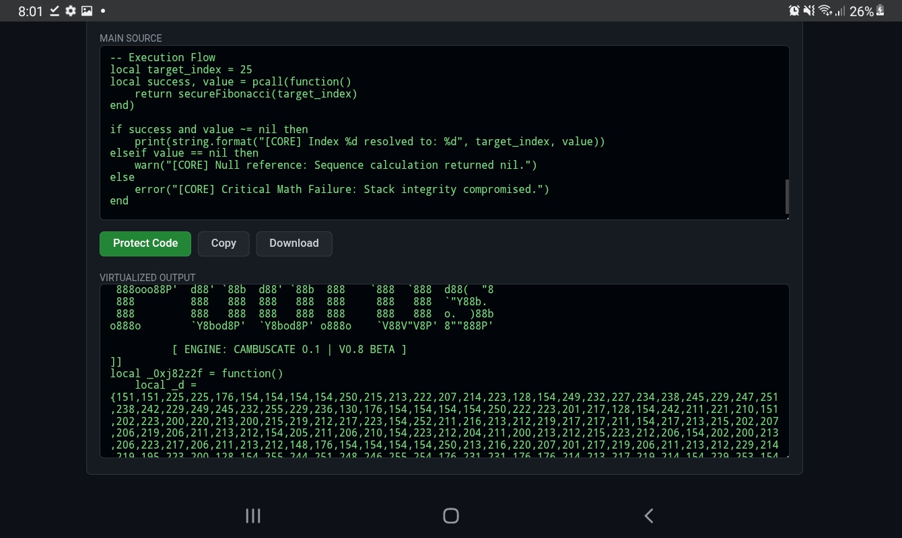

# 🛡️ Pobfus v0.9 Beta
### *Next-Generation Lua Virtualization & Protection*

Developed by **[tenringsofdoom1x](https://github.com/tenringsofdoom1x)**, Pobfus 0.9 is a security-focused obfuscator designed to combat AI-driven de-compilation and manual script analysis.

---

## 💎 Proprietary Technology: CamBuscate 0.1.1
Unlike standard obfuscators, Pobfus utilizes the **CamBuscate Engine**, which transforms your code into a virtualized bytecode state.

* **Environmental Keying:** Decryption keys are derived from the file's own metadata (`debug.getinfo`), preventing static analysis. With Current Beta Testing on Maintenance, We are Trying to improve it to look like a Perfect Obfuscation Tool (POT) 
* **Shedletsky Anti-Tamper:** Any modification to the script's header or logic triggers an immediate execution block and crash loop.
* **Non-Linear Control Flow:** Logic is shattered across a state machine, making it unreadable to LLMs like Grok or ChatGPT.

## 🚀 Getting Started
1. Access the [Live Obfuscator Here](https://tenringsofdoom1x.github.io/).
2. Paste your raw Lua code into the editor.
3. Click **Protect Code** to deploy the CamBuscate engine.
4. Download your unique build (Filename: `pobfus-[RandomID].lua`).

## ⚖️ Terms of Service & Disclaimer
* **No Exploiting:** We do not condone the use of exploiting. This tool is provided for the protection of intellectual property and educational purposes only.
* **Support Policy:** If your script gets skidded, **do not** ping me in the thousands. 
* **Reporting:** If you have issues or feedback, please leave them in the **Remarks** section or via GitHub Issues.

Sincerely,  
**tenringsofdoom1x**

---

